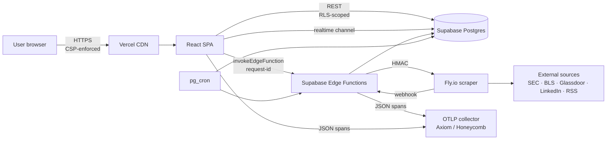
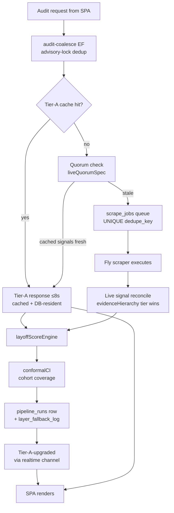
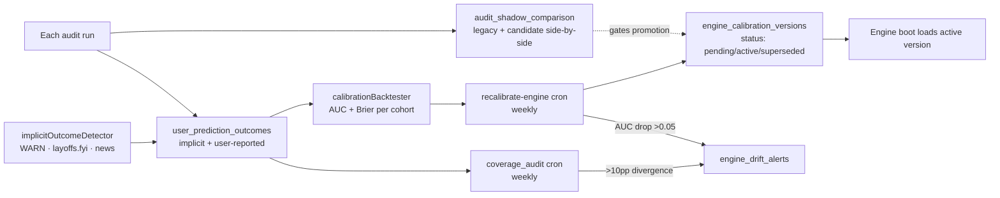
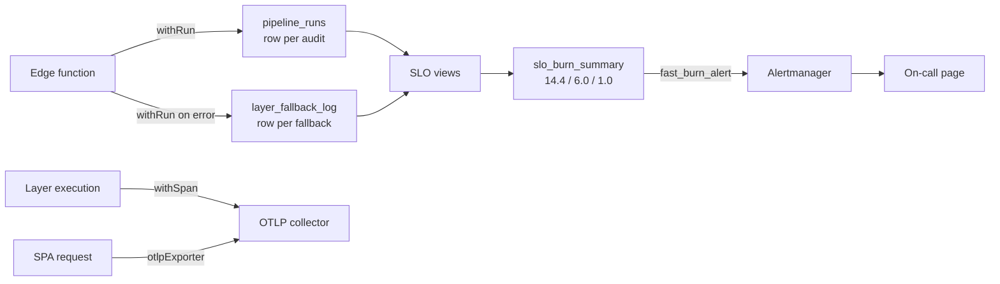
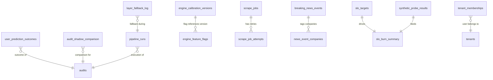
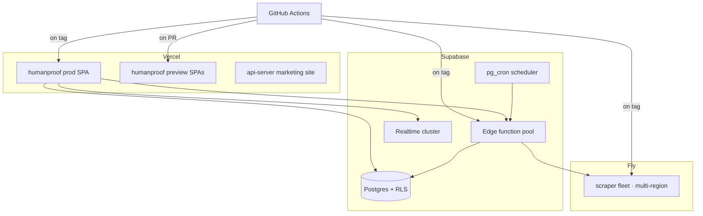
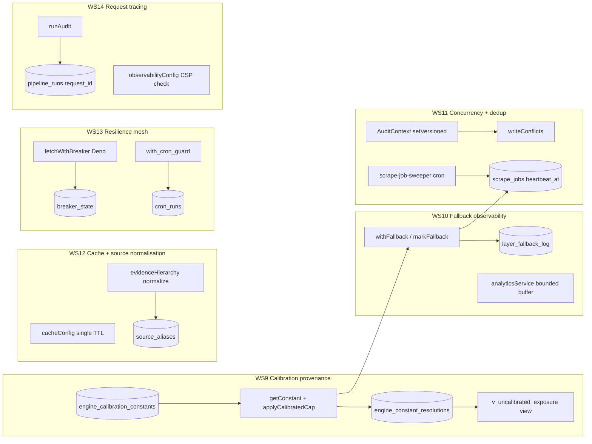

# System Architecture

This document is the **map**. It describes the major moving parts of
the layoff-audit platform, the data flows between them, and where each
class of failure surfaces. It is intentionally diagram-heavy — the
prose lives elsewhere (see [HYBRID_ARCHITECTURE_BLUEPRINT.md](./HYBRID_ARCHITECTURE_BLUEPRINT.md)
for the design rationale, and the [runbooks/](./runbooks/) for the
operational procedures).

If a new contributor needs to know "where does X happen," this is the
file. If they need to know "why does X happen that way," they go to
the blueprint.

## High-level: request flow

The browser bundle never talks to Fly or external scraping sources
directly — those are reached only via edge functions, which gates them
behind RLS-backed auth and HMAC. The browser is allowed to write
analytics events and reach Supabase + OTLP only.

## Component inventory

| Component | Tech | Purpose | Owner |
|---|---|---|---|
| **React SPA**      | Vite + React 18 + Plus Jakarta Sans | Audit dashboard UI                                  | App team |
| **CDN**            | Vercel                              | Edge cache + SPA shell + CSP enforcement            | Platform |
| **API gateway**    | Supabase REST + GoTrue              | Authenticated CRUD with RLS                         | Platform |
| **Edge functions** | Supabase Deno runtime               | Audit pipeline, recalibration, health, synthetic    | Platform |
| **Database**       | Supabase Postgres 15 + pg_cron      | Source of truth: outcomes, calibration, jobs        | Platform |
| **Scraper**        | Fly.io Node service                 | Outbound scraping of Glassdoor / LinkedIn / Naukri  | Data team |
| **Telemetry**      | Axiom / Honeycomb via OTLP/HTTP     | Span + log storage                                  | Platform |
| **Realtime**       | Supabase Realtime (Phoenix)         | Broadcast-style fan-out for breaking-news + audits  | Platform |

## Audit pipeline (the hot path)

**The 8-second budget is hard.** Anything that can't be answered within
8s falls into Tier-A-upgraded, pushed via realtime. The SPA shows the
tier transition (`Tier 2 estimate → Tier 1 confirmed`) so the user
sees the upgrade rather than waiting silently.

## Empirical truth loop

The promotion gate. New scoring logic ships behind a flag in shadow
mode; only when its outcomes match the legacy engine's coverage (or
beat it) does it become default.

The drift alert is the safety valve. If a recalibration cron produces
a worse model, it lands in `pending` state and pages on-call rather
than auto-promoting.

## Observability

Every spannable operation writes to one of three sinks:

Synthetic probes (`/functions/v1/synthetic-probe`) run every 5 minutes
and write into `synthetic_probe_results`. They feed the same SLO views,
so a synthetic failure burns budget identically to a user-facing one.

## Storage layout

The columns that matter most for invariants:

- `scrape_jobs.dedupe_key` is `UNIQUE`. This is the foundation of the
  10k-concurrent-users guarantee — a stampede converges to one row.
- `engine_calibration_versions.status` is the lifecycle gate. Engine
  boot reads `status='active'` only.
- `tenant_memberships.tenant_id` is the RLS pivot for every
  user-scoped table.

## Deployment topology

Each tagged release goes out simultaneously to Vercel, Supabase, and
Fly. Schema migrations are gated by the migration-drift CI job — a PR
that adds a SQL file without running `supabase db diff` fails CI.

## Failure-mode → runbook map

| Failure | What you see | Runbook |
|---|---|---|
| Database unreachable             | health-probe 503 on `db_connectivity`            | [db-outage](./runbooks/db-outage.md) |
| Scrape source blocked            | layer_fallback rate >5% for 15min                | [scraper-down](./runbooks/scraper-down.md) |
| Calibration AUC drops            | engine_drift_alerts row + Slack page             | [calibration-drift](./runbooks/calibration-drift.md) |
| RLS denial spike                 | repository errors with `JWT` or `42501`          | [auth-failure](./runbooks/auth-failure.md) |
| Realtime backpressure            | breaking-news event lag >30s                     | [news-flood](./runbooks/news-flood.md) |
| Quarterly / leaked key rotation  | scheduled / GitHub secret alert                  | [secrets-rotation](./runbooks/secrets-rotation.md) |
| Catastrophic data loss           | PITR-window-bound corruption / project deletion  | [DISASTER_RECOVERY](./DISASTER_RECOVERY.md) |

## v35.1 operational hardening (WS9–WS14)

The strategic transformation (WS0–WS8) made the system *empirically
honest*. v35.1 makes it *operationally observable* — every silent
fallback path, every uncalibrated constant, every concurrent-audit
race becomes visible in telemetry. The substrate added here:

**Cross-cutting CI gate:** `scripts/check-architecture-rules.mjs`
enforces five regression-prevention rules:

| Rule | Pattern flagged | Severity |
|---|---|---|
| R1 | Direct `supabase.functions.invoke()` outside `invokeEdgeFunction` | HARD |
| R2 | Silent `.catch(() => null/undefined/{})` | SOFT (advisory) |
| R2-strict | `.catch(() => 0.<digits>)` numeric fallback | HARD |
| R3 | `fetch()` in `services/**` without circuit breaker | HARD |
| R4 | Uncalibrated `0.XY` literals in Engine/Service/Builder files | SOFT (advisory) |
| R5 | `Math.max\|min` / `+` / `*` on `confidence`/`risk`/`weight` outside calibration | HARD |

Soft rules surface review-worthy patterns without blocking merges;
hard rules fail CI. Allowlist via `// arch-allow:R<n>` comment when
the rule is over-eager for a specific line.

## What this document does NOT cover

- **Per-layer scoring math** — see the source of each layer; the
  contract is the layer's input + output schema.
- **Per-component code structure** — see `src/services/` for the
  scoring graph; `supabase/functions/` for each edge function.
- **Per-feature product UX** — see Figma / PRD docs.
- **Why the architecture is this way** — see
  [HYBRID_ARCHITECTURE_BLUEPRINT.md](./HYBRID_ARCHITECTURE_BLUEPRINT.md).

This file is the **what** and **where**. The **why** lives elsewhere
on purpose — the diagrams are stable across multiple "why" rewrites.
